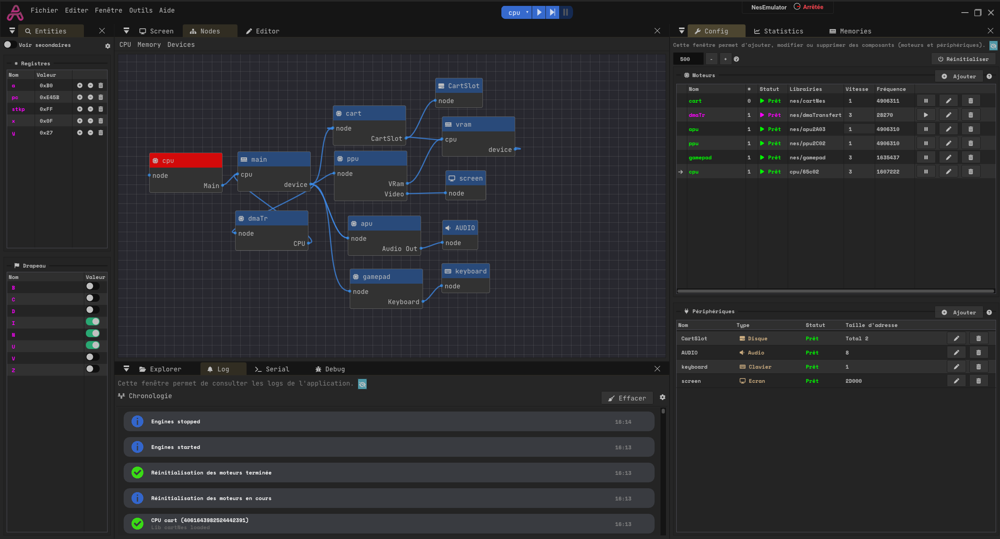

    

### **[En français ici](docs/README-FR.md)**

## What is AZ Emulator

    

AZ Emulator is a tools to create 8 or 16 bit CPU emulator (32 bit CPU in dev).

It's based on an external libraries system, ([more info here](docs/Librairies.md)), allowing hot swapping and easy new core development.

AZ Emulator have multiple functions:
- Project management, allowing development on multiple emulator
- A configuration panel
- A node visualizer
- A memories management and manipulation system
- An internal registers editor
- A debug panel, allowing instruction by instruction debugging
- An easy devices integration (keyboard, disk, screen, sound)
- A state save system

## Images

    
    
    

More images [here](./docs/img/README.md).

## Core CPU included

To test my emulator, I integrated some open sources engine :

- **CPU 65c02** by OneLoneCoder : https://github.com/OneLoneCoder/olcNES
- **CPU 8086** by kxkx5150 : https://github.com/kxkx5150/CPU-8086-cpp
- **CPU i686** by kxkx5150 : https://github.com/kxkx5150/CPU-IA32-cpp

## Examples

- [**Simple 65c02**](./docs/Example-65c02.md)
- [**Microsoft Basic**](./docs/Example-MSBASIC.md)
- [**X16 Emulator**](./docs/Example-X16.md)
- [**NES Emulator**](./docs/Example-NES.md)
- [**IBM 8086**](./docs/Example-i8086.md)

## Dependencies :

- opengl
- glfw / SDL2 : https://github.com/glfw/glfw
- spdlog : https://github.com/gabime/spdlog
- yaml-cpp : https://github.com/jbeder/yaml-cpp/tree/master
- imgui : https://github.com/juliettef/imgui_markdown
- imnodes : https://github.com/Nelarius/imnodes
- implot : https://github.com/epezent/implot
- imgui_toggle : https://github.com/cmdwtf/imgui_toggle
- imgui_markdown : https://github.com/juliettef/imgui_markdown
- imspinner : https://github.com/dalerank/imspinner
- stb_image : https://github.com/nothings/stb
- tiny_file_dialog : https://github.com/native-toolkit/libtinyfiledialogs
- miniaudio : https://github.com/mackron/miniaudio
- OptickCore : https://github.com/bombomby/optick/
- sha1 : https://github.com/vog/sha1/blob/master/sha1.hpp

UI design inspired by TheCherno C++ App (https://www.youtube.com/@TheCherno)
