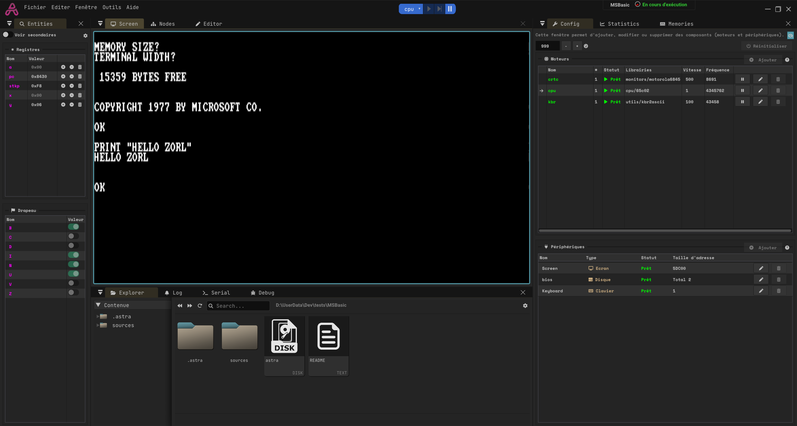
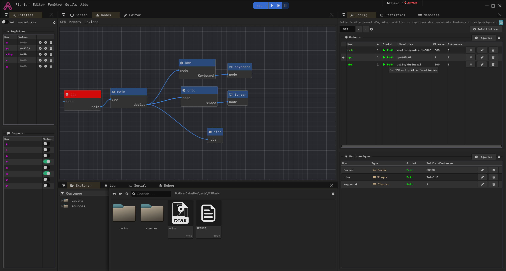

## Microsoft Basic

In this template, microsoft basic is running on a 65c02 CPU.

## Link of the project
https://github.com/mist64/msbasic

## Instructions
- Press the PLAY button
- Focus the Screen panel (aka panel must have a blue border) to enable keyboard

## Images

    
    

