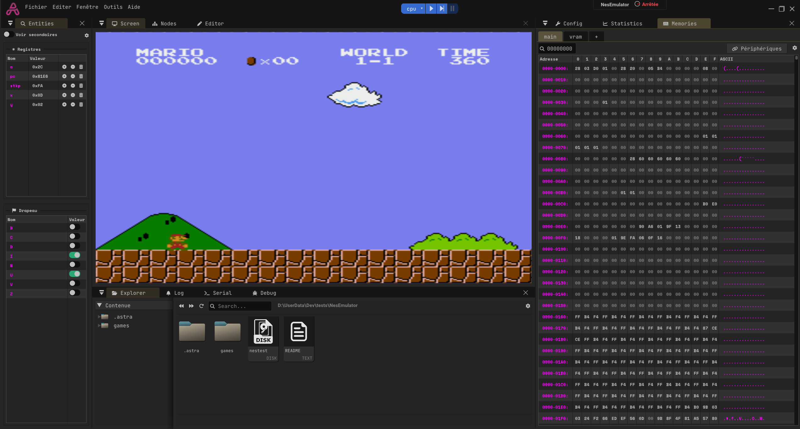

# Nintendo Entertainment System emulator

In this template, a NES running over a 6502 CPU.

On can change the running game by settings the CartSlot devices with an other rom file (filename must end with .dsk).

## Instructions
- Press the RESET button
- Press the PLAY button
- Focus the Screen panel (aka panel must have a blue border) to enable keyboard
- Use arrows button and ZSAX (en) / QSXW (fr) to emumate the gamepad
- You can change the speed in the config panel

## Images

    
    
    

