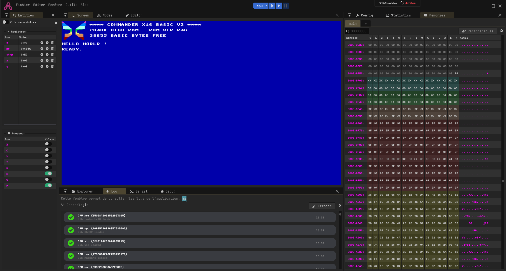

# Commander X16 emulator

In this template, a complete commander X16 emulator.

## Useful links
- The 8 bit guy videos : https://www.youtube.com/playlist?list=PLfABUWdDse7bKGFshxR0itdHBhjUj86SX
- X16 official emulator : https://github.com/X16Community/x16-emulator

## Instructions
- Press the RESET button
- Press the PLAY button
- Focus the Screen panel (aka panel must have a blue border) to enable keyboard

## Note
Mouse is working but audio has an issue

## Images

    
    
    

