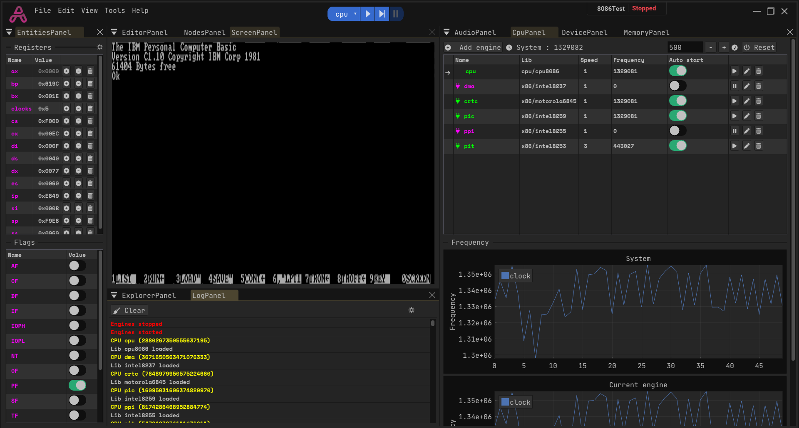
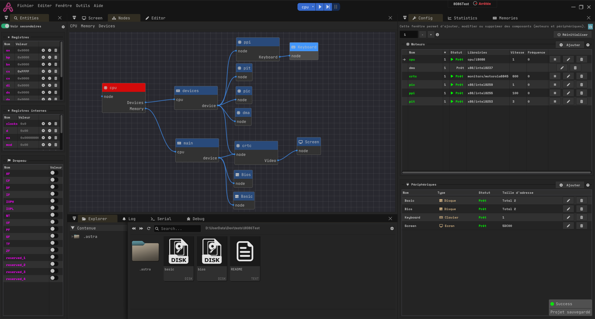

# IBM bios init

In this template, an IBM pc is configured to load the IBM bios.

Keyboard not working ATM.

## Instructions
- Press the RESET button
- Press the PLAY button

## Images

    
    

