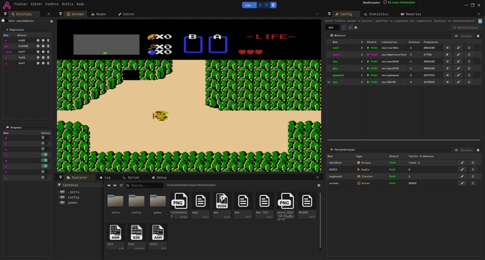
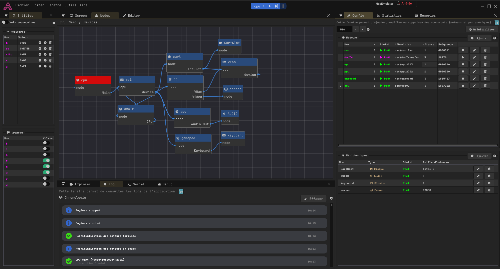
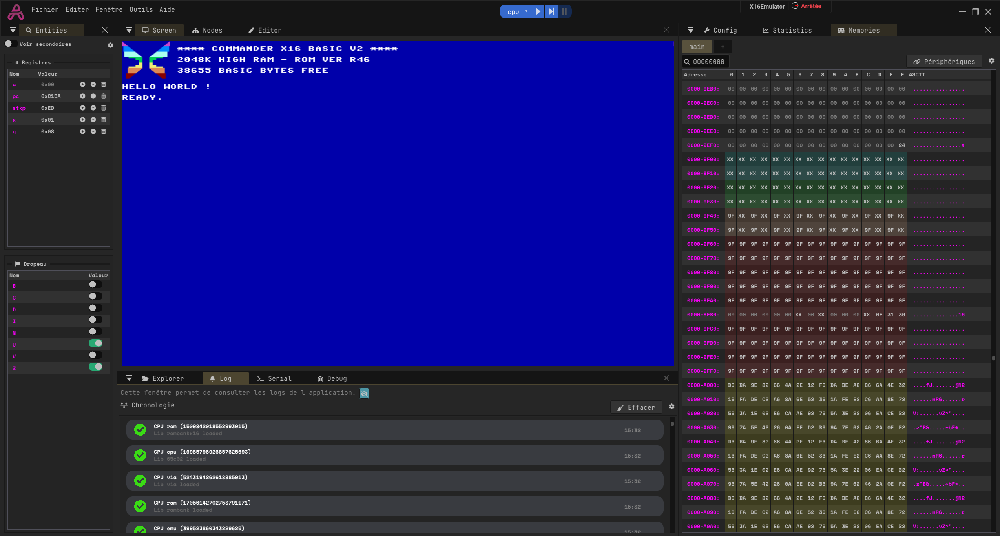

    

## Qu'est ce que AZ Emulator

    

AZ Emulator est un outil d'émulation de processeur 8 et 16 bit (32 bit en développement).

Il utilise un système de librairies esternes ([plus d'info ici](Librairies.md)) permettant le chargement facile de nouveaux cores.

AZ Emulator offre de nombreux outils :
- Une gestion par projet, permettant le développement de plusieurs émulateurs
- Une interface de configuration
- Un visualiseur sous la forme de node
- Une interface pour la gestion et la manipulation de la mémoire
- Une interface permettant de visualiser l'état des registres internes
- Une interface permettant le débogage, instruction par instruction
- Une gestion simplifiée des périphériques (clavier, disque, écran, son)
- Un système de sauvegarde de l'état du CPU

## Images

    
    
    

Plus d'images [ici](./img/README.md).

## Core cpu inclus

Pour simplifier mon développement, je me suis basé sur les développement suivant :

- **CPU 65c02** par OneLoneCoder : https://github.com/OneLoneCoder/olcNES
- **CPU intel 8086** par kxkx5150 : https://github.com/kxkx5150/CPU-8086-cpp
- **CPU intel i686** par kxkx5150 : https://github.com/kxkx5150/CPU-IA32-cpp

## Exemples

- [**Simple 65c02**](./Example-65c02.md)
- [**Microsoft Basic**](./Example-MSBASIC.md)
- [**X16 Emulator**](./Example-X16.md)
- [**NES Emulator**](./Example-NES.md)
- [**IBM 8086**](./Example-i8086.md)

## Librairies utilisées :

- opengl
- glfw : https://github.com/glfw/glfw
- spdlog : https://github.com/gabime/spdlog
- yaml-cpp : https://github.com/jbeder/yaml-cpp/tree/master
- imgui : https://github.com/juliettef/imgui_markdown
- imnodes : https://github.com/Nelarius/imnodes
- implot : https://github.com/epezent/implot
- imgui_toggle : https://github.com/cmdwtf/imgui_toggle
- imgui_markdown : https://github.com/juliettef/imgui_markdown
- imspinner : https://github.com/dalerank/imspinner
- stb_image : https://github.com/nothings/stb
- tiny_file_dialog : https://github.com/native-toolkit/libtinyfiledialogs
- miniaudio : https://github.com/mackron/miniaudio
- OptickCore : https://github.com/bombomby/optick/
- sha1 : https://github.com/vog/sha1/blob/master/sha1.hpp

UI design inspiré par TheCherno C++ App (https://www.youtube.com/@TheCherno)
